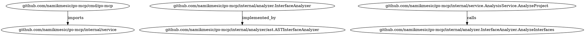
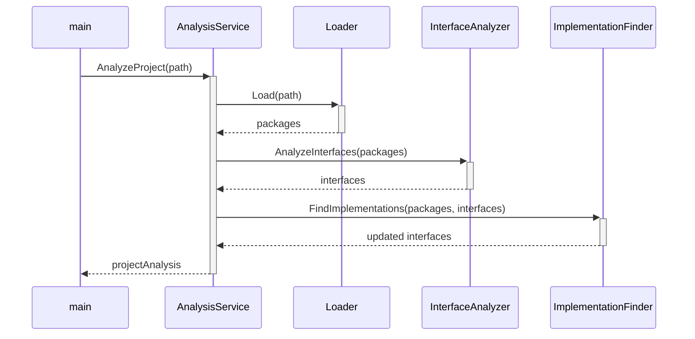

# Feature Request: LLM-Optimized Code Understanding with SME Collaboration

## Overview

This feature request proposes two complementary enhancements to go-mcp:

1. **Enhanced Code Representation**: Generate rich, structured representations of Go codebases specifically optimized for Large Language Models (LLMs).

2. **SME-Assisted Generation**: Integrate repository Subject Matter Expert (SME) collaboration into the analysis and query process to provide critical business context and domain knowledge.

## Background

Go-MCP already excels at extracting valuable structural information from Go codebases, including:
- Interface definitions and methods
- Concrete implementations of interfaces
- Call graphs between functions/methods
- Package relationships

However, two key limitations exist in the current system:

1. **Relationship Representation**: The current JSON output format, while comprehensive, doesn't optimally represent the relationships between code elements in a way that maximizes LLM understanding. LLMs benefit from representations that explicitly model the relationships between components, especially when provided with contextual information about how these components interact.

2. **Business Context Gap**: Static code analysis, no matter how thorough, cannot capture the business reasoning, domain-specific knowledge, and historical context behind implementation decisions. This information typically resides with the Subject Matter Experts (SMEs) who understand both the code and its business purpose.

## Feature 1: LLM-Optimized Code Representation

### Feature Description

We propose adding a new output mode to go-mcp that generates "LLM-optimized" representations of code analysis. This feature would:

1. **Generate Rich Contextual Documents**: Create comprehensive markdown descriptions for each component that include purpose, relationships, and behavior.

2. **Construct Knowledge Graphs**: Transform the analysis into explicit knowledge graph representations that highlight relationships.

3. **Produce Code Flow Visualizations**: Generate sequence and flow diagrams that illustrate execution paths and component interactions.

4. **Provide Embeddings Preparation**: Prepare the output in formats that facilitate high-quality vector embeddings for retrieval-augmented generation.

## Proposed Implementation for Feature 1

### 1. Rich Contextual Document Generator

Add a new subcommand to go-mcp:

```
go-mcp llm-docs /path/to/project
```

This would output a series of markdown documents, one for each significant component (package, interface, major type), structured as follows:

```markdown
# Component: {ComponentName}

## Purpose
{Extracted or inferred purpose based on naming, comments, and usage patterns}

## Dependencies
{List of components this component depends on}

## Dependents
{List of components that depend on this component}

## Interface Relationships
{For interfaces: list of implementations}
{For implementations: list of interfaces implemented}

## Call Graph
{Incoming calls from other components}
{Outgoing calls to other components}

## Code Structure
{Key methods/functions with signatures}
{Parameter and return type information}

## Source Location
{File path and line number information}
```

### 2. Knowledge Graph Exporter

Enhance the existing Neo4j support to specifically model code relationships as a knowledge graph:

```
go-mcp llm-graph /path/to/project --format=dot|neo4j|json
```

The graph would model:
- Nodes: Packages, interfaces, types, methods, functions
- Edges: Implements, calls, depends-on, contains

Example DOT output:


### 3. Code Flow Visualization

Generate sequence diagrams and flow charts to visualize execution paths:

```
go-mcp llm-flow /path/to/project --entry=main.main --format=mermaid|plantuml
```

Example Mermaid output:


### 4. Embeddings Preparation

Provide output specifically formatted for creating high-quality vector embeddings:

```
go-mcp llm-embed /path/to/project --format=jsonl|csv
```

This would generate embedding-ready documents that combine code snippets with their relationships and context, optimized for chunk size and information density.

Example output (JSONL):
```jsonl
{"id":"pkg:github.com/namikmesic/go-mcp/internal/service", "text":"Package service provides the main analysis orchestration. It coordinates loading packages, analyzing interfaces, and finding implementations. Key dependencies: loader.Loader, analyzer.InterfaceAnalyzer, analyzer.ImplementationFinder, analyzer.CallGraphAnalyzer. The core functionality is exposed through the AnalyzeProject method, which is called by main.main()."}
{"id":"interface:github.com/namikmesic/go-mcp/internal/analyzer.InterfaceAnalyzer", "text":"InterfaceAnalyzer is an interface defined in github.com/namikmesic/go-mcp/internal/analyzer with method AnalyzeInterfaces(pkgs []*packages.Package) (map[string]*datamodel.Interface, error). It is implemented by ASTInterfaceAnalyzer in github.com/namikmesic/go-mcp/internal/analyzer/ast. It is used by AnalysisService.AnalyzeProject to extract interface definitions from packages."}
```

### Expected Benefits

1. **Superior LLM Code Understanding**: LLMs will be able to develop a more comprehensive mental model of code structure and behavior.

2. **More Accurate Responses**: When answering questions about code, LLMs will have access to explicit relationship information rather than having to infer it.

3. **Better Code Generation**: LLMs will be better equipped to generate code that fits within existing architectural patterns.

4. **Enhanced Code Navigation**: Users can ask high-level questions about code structure and get accurate answers based on the rich relationship model.

5. **Architectural Insight**: The visualizations and knowledge graphs will provide valuable architectural insight even without LLM integration.

### Implementation Considerations

1. **Extensibility**: The design should allow for extension to additional output formats.

2. **Inference Capabilities**: While go-mcp excels at extracting explicit relationships, we might want to add inference capabilities for implicit relationships (e.g., architectural patterns).

3. **Integration with Existing Embeddings Tools**: Ensure output formats are compatible with common vector database ingestion pipelines.

4. **Performance**: For large codebases, consider incremental processing options.

### Example Use Case

Let's illustrate the value using go-mcp itself as an example:

1. A developer wants to understand how the analyzer components interact
2. They run `go-mcp llm-docs .` to generate contextual documents
3. They load these documents into their LLM tool
4. They can now ask questions like:
   - "How does the interface analysis work in go-mcp?"
   - "What's the call flow when analyzing a project?"
   - "Which components would be affected if I changed the InterfaceAnalyzer interface?"

The LLM can provide accurate answers because it has explicit information about the relationships between components, not just individual code snippets.

## Feature 2: SME-Assisted Code Understanding

### Overview

While static code analysis provides valuable structural insights, it cannot capture the full context of business requirements, historical decisions, and domain-specific knowledge embedded in a codebase. This feature proposes integrating repository Subject Matter Expert (SME) collaboration into the analysis and query process.

### Feature Description

The SME-Assisted Code Understanding feature would:

1. **Provide Interactive SME Consultation**: Allow LLMs to request human SME input when encountering questions that require domain expertise or business context.

2. **Capture and Index SME Knowledge**: Store and index SME insights for future reuse, building a knowledge base of non-code contextual information.

3. **Enrich Code Analysis**: Integrate SME-provided context with static analysis to form a more complete understanding of the codebase.

4. **Support Collaborative Exploration**: Enable an iterative process where LLMs and SMEs work together to explore complex code questions.

### Proposed Implementation

#### 1. SME Query Interface

Add a new interactive mode to go-mcp:

```
go-mcp sme-mode /path/to/project
```

This would:
- Run the initial code analysis
- Provide a chat-like interface where an LLM can ask the SME specific questions when needed
- Record interactions for future reference

#### 2. Knowledge Gap Detection

Implement an algorithm to detect when the LLM might benefit from SME input:

```go
type KnowledgeGap struct {
    Context     string   // The code or analysis context where the gap was detected
    Query       string   // The specific question for the SME
    Confidence  float64  // How confident the system is that SME input is needed (0-1)
    Suggestions []string // Possible areas the SME might elaborate on
}

func DetectKnowledgeGaps(codeContext string, query string) []KnowledgeGap {
    // Implementation that uses heuristics to identify when SME input would be valuable
    // For example, business logic questions, architectural decisions, etc.
}
```

#### 3. SME Knowledge Base

Create a structured repository for storing SME insights:

```
go-mcp kb-add /path/to/project --topic="Authentication Flow" --context="/auth/middleware.go"
```

This would prompt the SME to provide insights about the specified topic and associate it with the relevant code context.

#### 4. Context-Aware SME Prompting

Develop intelligent prompts for SMEs that provide the right amount of context:

```
go-mcp prompt-sme /path/to/project --function="ValidateToken" --question="Why is JWT used here instead of session tokens?"
```

This would:
- Extract the relevant code
- Format it with appropriate context
- Present a specific, focused question to the SME
- Record the response for future similar questions

#### 5. Combined Analysis Output

Generate analysis outputs that integrate both static analysis and SME knowledge:

```
go-mcp analyze-with-context /path/to/project --format=markdown
```

Example output:
```markdown
# Authentication System

## Code Structure
[Technical details from static analysis]

## Business Context (from SME)
This authentication system was designed to support our microservices architecture where services need to validate user permissions without maintaining session state. JWT was chosen specifically because:

1. Our compliance requirements mandate short-lived tokens (max 15 minutes)
2. Services need to validate tokens without database lookups
3. The mobile app needs to work offline for certain features

## Known Limitations (from SME)
The current implementation doesn't support token revocation. This is a deliberate trade-off that was made to avoid cross-service dependencies.
```

### Expected Benefits

1. **Deeper Contextual Understanding**: LLMs gain access to the "why" behind code decisions, not just the "what" and "how".

2. **Preservation of Institutional Knowledge**: Capture valuable domain expertise that would otherwise exist only in the minds of SMEs.

3. **More Accurate Responses**: When answering questions about code purpose and business context, LLMs can leverage explicit SME knowledge.

4. **Reduced SME Interruptions**: By building a knowledge base of common questions, repeated interruptions to SMEs can be minimized.

5. **Bridge Technical and Business Understanding**: Help translate between technical implementation details and business requirements.

### Implementation Considerations

1. **Privacy and Confidentiality**: Ensure sensitive business logic explanations are handled appropriately.

2. **SME Time Efficiency**: Design the system to maximize value from limited SME availability.

3. **Knowledge Validation**: Provide mechanisms for reviewing and correcting stored SME knowledge.

4. **Integration with Version Control**: Consider how SME knowledge should be versioned alongside code changes.

### Example Use Case

A developer is trying to understand a complex pricing algorithm:

1. The LLM explains the code structure based on static analysis
2. The developer asks "Why do we have special handling for EU customers?"
3. The LLM detects this requires business context and consults the knowledge base
4. Finding no existing explanation, it prompts the SME for input
5. The SME explains "EU customers are subject to VAT regulations that vary by country"
6. This explanation is stored in the knowledge base for future reference
7. The LLM provides a comprehensive answer that includes both the technical implementation and the business context


## What Makes This Approach Powerful
**Solves the "Context Gap" Problem**
Most code analysis tools provide technical relationships but completely miss the business context and reasoning behind implementation decisions. By combining static analysis with SME knowledge, you're creating a more complete understanding that no other tool currently offers.
**Creates Institutional Memory**
Organizations struggle with knowledge loss when developers leave. This approach creates a permanent record of not just what the code does, but why certain approaches were taken, which is often the most valuable and hardest-to-recover information.
**Adaptive Learning System**
The system becomes more valuable over time. Each SME interaction enriches the knowledge base, meaning future questions become increasingly likely to have pre-existing answers, reducing the need to interrupt SMEs.
Balanced Workload
LLMs handle the heavy lifting of understanding code structure, while SMEs only need to provide unique insights that can't be derived from the code itself. This respects the SME's time by only asking for high-value contributions.

## Implementation Challenges to Consider

**SME Engagement**
Getting busy SMEs to participate consistently is often challenging. The interface needs to be extremely low-friction, perhaps integrated into communication tools they already use.
**Knowledge Versioning**
As code evolves, some SME insights may become outdated. You'll need a strategy for versioning knowledge alongside code changes and flagging potentially outdated explanations.
**Knowledge Gap Detection**
Building an algorithm that accurately identifies when SME input is truly needed (versus when the LLM can derive an answer) will be crucial for not overwhelming SMEs with requests.
Integration with Development Workflow
The tool needs to fit naturally into existing development workflows to gain adoption - perhaps integrating with IDEs, code review tools, or documentation systems.

## Implementation Challenges to Consider

This approach represents a significant advancement over current code understanding tools. It recognizes that comprehensive code understanding requires both technical analysis and business context - something no purely automated tool can currently provide.
For complex enterprise codebases with significant domain knowledge requirements, this could become an essential part of the developer toolkit. It would be particularly valuable for:

- Onboarding new developers
- Understanding legacy systems
- Maintaining compliance-critical systems where design decisions need documentation
- Supporting remote/distributed teams where casual knowledge sharing is limited

## Conclusion
By combining enhanced code representations with SME-assisted understanding, go-mcp can bridge the gap between technical implementation and business context. This dual approach positions go-mcp as a comprehensive solution for code understanding that leverages both automated analysis and human expertise. Together, these features would transform how developers interact with complex codebases and how organizations preserve and share their institutional knowledge.
The dual nature of the approach - providing value through both better LLM representations and SME knowledge capture - means it can deliver benefits even in environments where one or the other might face adoption challenges.
