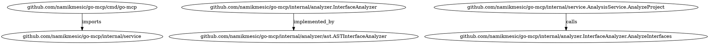
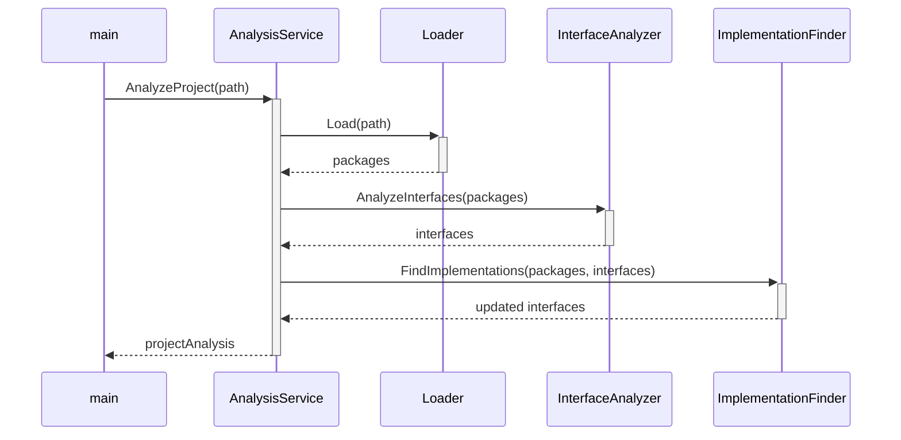

# Feature Request: LLM-Optimized Code Representation

## Overview

This feature request proposes enhancing go-mcp to generate rich, structured representations of Go codebases specifically optimized for Large Language Models (LLMs). By transforming the existing analysis into formats that better capture semantic relationships, we can enable LLMs to develop a deeper "god mode" understanding of code structure, behavior, and relationships.

## Background

Go-MCP already excels at extracting valuable structural information from Go codebases, including:
- Interface definitions and methods
- Concrete implementations of interfaces
- Call graphs between functions/methods
- Package relationships

However, the current JSON output format, while comprehensive, doesn't optimally represent the relationships between these elements in a way that maximizes LLM understanding. LLMs benefit from representations that explicitly model the relationships between code components, especially when provided with contextual information about how these components interact.

## Feature Description

We propose adding a new output mode to go-mcp that generates "LLM-optimized" representations of code analysis. This feature would:

1. **Generate Rich Contextual Documents**: Create comprehensive markdown descriptions for each component that include purpose, relationships, and behavior.

2. **Construct Knowledge Graphs**: Transform the analysis into explicit knowledge graph representations that highlight relationships.

3. **Produce Code Flow Visualizations**: Generate sequence and flow diagrams that illustrate execution paths and component interactions.

4. **Provide Embeddings Preparation**: Prepare the output in formats that facilitate high-quality vector embeddings for retrieval-augmented generation.

## Proposed Implementation

### 1. Rich Contextual Document Generator

Add a new subcommand to go-mcp:

```
go-mcp llm-docs /path/to/project
```

This would output a series of markdown documents, one for each significant component (package, interface, major type), structured as follows:

```markdown
# Component: {ComponentName}

## Purpose
{Extracted or inferred purpose based on naming, comments, and usage patterns}

## Dependencies
{List of components this component depends on}

## Dependents
{List of components that depend on this component}

## Interface Relationships
{For interfaces: list of implementations}
{For implementations: list of interfaces implemented}

## Call Graph
{Incoming calls from other components}
{Outgoing calls to other components}

## Code Structure
{Key methods/functions with signatures}
{Parameter and return type information}

## Source Location
{File path and line number information}
```

### 2. Knowledge Graph Exporter

Enhance the existing Neo4j support to specifically model code relationships as a knowledge graph:

```
go-mcp llm-graph /path/to/project --format=dot|neo4j|json
```

The graph would model:
- Nodes: Packages, interfaces, types, methods, functions
- Edges: Implements, calls, depends-on, contains

Example DOT output:


### 3. Code Flow Visualization

Generate sequence diagrams and flow charts to visualize execution paths:

```
go-mcp llm-flow /path/to/project --entry=main.main --format=mermaid|plantuml
```

Example Mermaid output:


### 4. Embeddings Preparation

Provide output specifically formatted for creating high-quality vector embeddings:

```
go-mcp llm-embed /path/to/project --format=jsonl|csv
```

This would generate embedding-ready documents that combine code snippets with their relationships and context, optimized for chunk size and information density.

Example output (JSONL):
```jsonl
{"id":"pkg:github.com/namikmesic/go-mcp/internal/service", "text":"Package service provides the main analysis orchestration. It coordinates loading packages, analyzing interfaces, and finding implementations. Key dependencies: loader.Loader, analyzer.InterfaceAnalyzer, analyzer.ImplementationFinder, analyzer.CallGraphAnalyzer. The core functionality is exposed through the AnalyzeProject method, which is called by main.main()."}
{"id":"interface:github.com/namikmesic/go-mcp/internal/analyzer.InterfaceAnalyzer", "text":"InterfaceAnalyzer is an interface defined in github.com/namikmesic/go-mcp/internal/analyzer with method AnalyzeInterfaces(pkgs []*packages.Package) (map[string]*datamodel.Interface, error). It is implemented by ASTInterfaceAnalyzer in github.com/namikmesic/go-mcp/internal/analyzer/ast. It is used by AnalysisService.AnalyzeProject to extract interface definitions from packages."}
```

## Expected Benefits

1. **Superior LLM Code Understanding**: LLMs will be able to develop a more comprehensive mental model of code structure and behavior.

2. **More Accurate Responses**: When answering questions about code, LLMs will have access to explicit relationship information rather than having to infer it.

3. **Better Code Generation**: LLMs will be better equipped to generate code that fits within existing architectural patterns.

4. **Enhanced Code Navigation**: Users can ask high-level questions about code structure and get accurate answers based on the rich relationship model.

5. **Architectural Insight**: The visualizations and knowledge graphs will provide valuable architectural insight even without LLM integration.

## Implementation Considerations

1. **Extensibility**: The design should allow for extension to additional output formats.

2. **Inference Capabilities**: While go-mcp excels at extracting explicit relationships, we might want to add inference capabilities for implicit relationships (e.g., architectural patterns).

3. **Integration with Existing Embeddings Tools**: Ensure output formats are compatible with common vector database ingestion pipelines.

4. **Performance**: For large codebases, consider incremental processing options.

## Example Use Case

Let's illustrate the value using go-mcp itself as an example:

1. A developer wants to understand how the analyzer components interact
2. They run `go-mcp llm-docs .` to generate contextual documents
3. They load these documents into their LLM tool
4. They can now ask questions like:
   - "How does the interface analysis work in go-mcp?"
   - "What's the call flow when analyzing a project?"
   - "Which components would be affected if I changed the InterfaceAnalyzer interface?"

The LLM can provide accurate answers because it has explicit information about the relationships between components, not just individual code snippets.

## Analysis

### What Makes This Approach Powerful

1. **Structured Relationship Representation**  
   Current code analysis typically focuses on individual components but fails to represent the rich web of relationships between them in a way LLMs can readily process. This approach explicitly models these relationships, enabling LLMs to form a more coherent mental model of the codebase.

2. **Multi-modal Information Delivery**  
   By providing information in multiple complementary formats (text documents, knowledge graphs, flow diagrams), the system plays to the strengths of modern LLMs that can process and integrate information across different representational formats.

3. **Bridging Technical Gap**  
   This approach bridges the gap between raw code and semantic understanding by translating structural code information into formats that align with how LLMs process knowledge about relationships and dependencies.

4. **Context-Rich Information**  
   Rather than splitting code into isolated chunks, this approach preserves and emphasizes the contextual relationships that make code understandable as a coherent system.

### Implementation Challenges to Consider

1. **Accuracy of Relationship Extraction**  
   Accurately identifying all relationships, especially in complex codebases with dynamic dispatch, reflection, or code generation, will be challenging but critical to the value proposition.

2. **Information Density Optimization**  
   Finding the right balance between comprehensive information and manageable chunk sizes for LLM processing will require careful tuning.

3. **Performance for Large Codebases**  
   Generating comprehensive relationship models for very large codebases may present performance challenges, potentially requiring incremental or partial analysis strategies.

4. **Handling Dynamic/Runtime Relationships**  
   Static analysis cannot capture all runtime relationships, particularly in highly dynamic languages or patterns. Clarifying these limitations will be important.

### Potential Industry Impact

This approach represents a significant advancement in how code is represented for machine understanding. It could transform several key areas:

- **Developer Onboarding**: Dramatically accelerate how quickly developers understand unfamiliar codebases.

- **Architectural Comprehension**: Enable higher-level understanding of system architecture through explicit relationship modeling.

- **Code Refactoring**: Provide clearer insight into potential impact of code changes across the system.

- **Documentation Automation**: Serve as the foundation for automatically generated, always up-to-date documentation.

- **Education and Training**: Offer a powerful tool for teaching software architecture and design patterns.

By creating representations that better align with how LLMs process and reason about information, this feature would significantly enhance the value of code analysis for AI-assisted development workflows and potentially establish a new standard for how code is represented for machine comprehension.